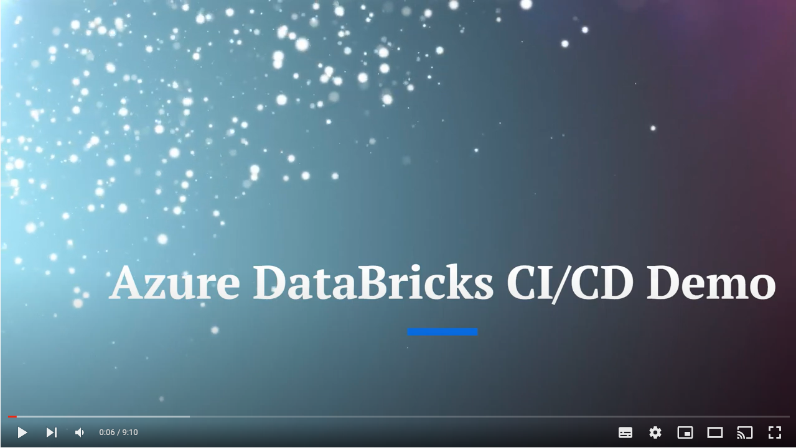

---
---
 <br>

 # Azure DevOps Version Now Live 
 - See ".azureDevOps" Folder - **Set Up Instructions To Follow** 
 # MLOps for Databricks with CI/CD (GitHub Actions)
---
 
 ## MLOps Architecture


Features to be included in future releases:
- Model testing & promotion 
- Metrics & Monitoring 
---

## Sections:
- [Youtube Demo](#Youtube-Demo)
- [About This Repository](#About-This-Repository)
- [Prerequisites](#Prerequisites)
- [Details of The Solution Accelerator](#Details-of-The-Solution-Accelerator)
- [Databricks as Infrastructure](#Databricks-as-Infrastructure)
- [Continuous Deployment and Branching Strategy](#Continuous-Deployment-And-Branching-Strategy)
- [Create Repository](#Create-Repository)
- [Login to Azure](#Login-To-Azure)
- [Provide SubscriptionID ](#Provide-SubscriptionID)
- [Create Main Service Principal](#Create-Main-Service-Principal)
- [Final Snapshot of Github Secrets](#Final-Snapshot-of-Github-Secrets)
- [Retrieve Object ID's](#Retrieve-Object-IDs)
- [Update Yaml Pipeline Parameters Files](#Update-Yaml-Pipeline-Parameters-Files)
- [Deploy the Azure Environments](#Deploy-The-Azure-Environments)
- [Run Machine Learning Scripts](#Run-Machine-Learning-Scripts)


---
---

## Youtube Demo 

Version 2 of the Demo video now released below!

[](https://youtu.be/g57N3GYXuDI)

---

## About This Repository

This Repository contains an Azure Databricks Continuous Deployment _and_ Continuous Development Framework for delivering Data Engineering/Machine Learning projects based on the below Azure Technologies:


| Azure Databricks | Azure Log Analytics | Azure Monitor Service  | Azure Key Vault        |
| ---------------- |:-------------------:| ----------------------:| ----------------------:|


Azure Databricks is a powerful technology, used by Data Engineers and Scientists ubiquitously. However, operationalizing it within a Continuous Integration and Deployment setup that is fully automated, may prove challenging. 

The net effect is a disproportionate amount of the Data Scientist/Engineers time contemplating DevOps matters. This Repository's guiding vision is to automate as much of the infrastructure as possible.

---
---

## Prerequisites
<details open>
<summary>Click Dropdown... </summary>
<br>
  
- Github Account
- Microsoft Azure Subscription
- VS Code
- Azure CLI Installed (This Accelerator is tested on version 2.39)

</details>

---
---

## Details of The Solution Accelerator

- Creation of four environments:
  - Sandbox
  - Development 
  - User Acceptance Testing (UAT)
  - Production
- Full CI/CD between environments
- Infrastructure-as-Code for interacting with Databricks API and also CLI
- Azure Service Principal Authentication
- Azure resource deployment using BICEP
- Databricks Feature Store + MLFlow Tracking + Model Registry + Model Experiments
- DBX by Data Labs for Continuous Deployment of Jobs/Workflows (source code/ parameters files packaged within DBFS)


---
---

## Databricks as Infrastructure
<details open>
<summary>Click Dropdown... </summary>

<br>
There are many ways that a User may create Databricks Jobs, Notebooks, Clusters, Secret Scopes etc. <br>
<br>
For example, they may interact with the Databricks API/CLI by using: <br>
<br>
i. VS Code on their local machine, <br>
ii. the Databricks GUI online; or <br>
iii. a YAML Pipeline deployment on a DevOps Agent (e.g. GitHub Actions or Azure DevOps etc). <br>
<br>
 
The programmatic way in which the first two scenarios allow us to interact with the Databricks API is akin to "Continuous **Development**", as opposed to "Continuous **Deployment**". The former is strong on flexibility, however, it is somewhat weak on governance, accountability and reproducibility. <br>

In a nutshell, Continuous **Development** _is a partly manual process where developers can deploy any changes to customers by simply clicking a button, while continuous **Deployment** emphasizes automating the entire process_.

</details>

---
---

 ## Continuous Deployment And Branching Strategy

The Branching Strategy I have chosen is configured automatically as part of the accelerator. It follows a GitHub Flow paradigm in order to facilitate rapid Continuous Integration, with some nuances. (see Footnote 1 which contains the SST Git Flow Article written by Willie Ahlers for the Data Science Toolkit - This provides a narrative explaining the numbers below)[^1]


The branching strategy is easy to change via updating the "if conditions" within .github/workflows/onRelease.yaml.


-   Pull Request from Feature Branch to Main Branch: C.I Tests
-   Pull Request approved from Feature Branch to Main Branch: C.D. to Development Environment 
-   Pull Request from Main Branch to Release Branch: C.I. Test
-   Pull Request approved from Main Branch to Release Branch: C.D. to User Acceptance Testing (UAT) Environment
-   Tag Version and Push to Release Branch: C.D. to Production Environment 
- Naming conventions for branches (to ensure the CD pipelines will deploy - onRelease.yaml for more details ):
  - Feature Branches: "feature/<insertname>"
  - Main Branch: "main"
  - Release branch "release/<insertname>"

---
---
## MLOps Paradigm: Deploy Code, not Models

In most situations, Databricks recommends that during the ML development process, you promote code, rather than models, from one environment to the next. Moving project assets this way ensures that all code in the ML development process goes through the same code review and integration testing processes. It also ensures that the production version of the model is trained on production code. For a more detailed discussion of the options and trade-offs, see Model deployment patterns.

https://learn.microsoft.com/en-us/azure/databricks/machine-learning/mlops/deployment-patterns


---
---
## Feature Store Integration 

In an organization, thousands of features are buried in different scripts and in different formats; they are not captured, organized, or preserved, and thus cannot be reused and leveraged by teams other than those who generated them.

Because feature engineering is so important for machine learning models and features cannot be shared, data scientists must duplicate their feature engineering efforts across teams.

To solve those problems, a concept called feature store was developed, so that:

- Features are centralized in an organization and can be reused
- Features can be served in real-time with low latency


---
---


## Create Repository
<details open>
<summary>Click Dropdown... </summary>
<br>
  
- Fork this repository [here](https://github.com/microsoft/dstoolkit-mlops-databricks/fork) 
- In your Forked Repo, click on 'Actions' and then 'Enable'
- Within your VS Code click, "View", then "Command Pallette", "Git: Clone", and finally select your Repo
</details>

---
---
 
## Login To Azure
- All Code Throughout To Go Into VS Code **PowerShell Terminal** 

 ```ps
az login

# If There Are Multiple Tenants In Your Subscription, Ensure You Specify The Correct Tenant "az login --tenant"

# ** Microsoft Employees Use: az login --tenant fdpo.onmicrosoft.com (New Non Prod Tenant )

```


## Provide SubscriptionID 
```ps
$SubscriptionId=( az account show --query id -o tsv )
```

## Create Main Service Principal 
**Why** : The Service Principal is a conduit for which we can authenticate into Azure. Personify it as as a User, with rights to access Azure Resources (as defined by Role Base Access conferred to it). If we have the Service Principal's secrets/credentials such as the Client Secret, Client ID and Tenant ID, all the powers held by the Service Principal will flow to the requestor. In this example, it will be the Github Action Runner/VM. 

```ps
# Create The Service Principal
# WARNING: DO NOT DELETE OUTPUT

$main_sp_name="main_sp_"+$(Get-Random -Minimum 1000 -Maximum 9999)

# use --sdk-auth flag if using GitHub Action Azure Authenticator 
$DBX_CREDENTIALS=( az ad sp create-for-rbac -n $main_sp_name --role Owner --scopes /subscriptions/$SubscriptionId --query "{ARM_TENANT_ID:tenant, ARM_CLIENT_ID:appId, ARM_CLIENT_SECRET:password}")


# Service Principal Credentials
$DBX_CREDENTIALS=( $DBX_CREDENTIALS | convertfrom-json )
echo $DBX_CREDENTIALS
$Client_ID=( $DBX_CREDENTIALS.ARM_CLIENT_ID )

```

---
---

## Create Environments 
Follow the naming convention (case sensitive)


## Secrets

**For each environment** create GitHub Secrets entitled **ARM_CLIENT_ID**, **ARM_CLIENT_SECRET** and **ARM_TENANT_ID** using the output in VS Code PowerShell Terminal from previous step.
(Note: The Service Principal below was destroyed, and therefore the credentials are useless )


In addition generate a GitHub Personal Access Token and use it to create a secret named ^**PAT_GITHUB**:


We are using the same Service Principal for each environment, which is not realistic. We might want to have different SPs for each environment, especially Production which is usually more locked down. We are also deploying to the same subscription, which you can change in order to strengthen isolation. 

---
---


 
## Final Snapshot of GitHub Secrets

Secrets in GitHub should look exactly like below. The secrets are case sensitive, therefore be very cautious when creating. 


---
---
 
## Retrieve Object IDs 

**Why**: The Object IDs will be used when assigning RBAC permissions at a later stage. 

1. Retrieve ObjectID of Databricks Service Principal:  
```ps
$main_sp_name_obj_id=( az ad sp show --id $Client_ID --query "{roleBeneficiaryObjID:id}" -o tsv )

echo "Back Stop Command For Older Azure CLI Command"
 
if ($main_sp_name_obj_id -eq "None" ) { $main_sp_name_obj_id=( az ad sp show --id $Client_ID --query "{roleBeneficiaryObjID:objectId}" -o tsv ) }
 
```

---

2. Retrieve your own ObectID:  
```ps
 
$User_ObjID=( az ad signed-in-user show --query "{roleBeneficiaryObjID:id}" -o tsv )
 
echo "Back Stop Command For Older Azure CLI Command"
 
if ($User_ObjID -eq "None" ) { $User_ObjID=( az ad signed-in-user show --query "{roleBeneficiaryObjID: objectId}" -o tsv ) }
 
```
---
---
 
## Update Yaml Pipeline Variables Files

- The Parameters file can be thought of as a quasi ARM Template for Databricks

We will update the variables files contained within .github/MLOps_Engineer/Variables/ . Enter scripts below into VS Code PowerShell Terminal.
  
```ps
echo "Enter Your Git Username... "
# Example: "Ciaran28"
$Git_Configuration = "Enter your GitHub Username"
```
  
  ```ps
echo "Enter Your Git Repo Url... "
# Example: ""  
$Repo_ConfigurationURL = "https://github.com/ciaran28/dstoolkit-mlops-databricks"
```
  
  
```ps
echo "Update The Variable Files"
$environments = @('Sandbox', 'Development', 'UAT', 'Production')
foreach ($environment in $environments)
{
   $JsonData = Get-Content .github\MLOps_Engineer\Variables\$environment\Repos.json -raw | ConvertFrom-Json
   foreach ($Obj in $JsonData.Git_Configuration)
   {
       ($Obj.git_username = $Git_Configuration )
   }
   foreach ($Obj in $JsonData.Repo_Configuration)
   {
       ($Obj.url = $Repo_ConfigurationURL )
   }
   $JsonData | ConvertTo-Json -Depth 4  | set-content .github\MLOps_Engineer\Variables\$environment\Repos.json -NoNewline
}
 
foreach ($environment in $environments)
{
  $JsonData = Get-Content .github\MLOps_Engineer\Variables\$environment\RBAC.json -raw | ConvertFrom-Json
  $JsonData.RBAC_Assignments | % {if($_.Description -eq 'Your Object ID'){$_.roleBeneficiaryObjID=$User_ObjID}}
  $JsonData.RBAC_Assignments | % {if($_.Description -eq 'Databricks SPN'){$_.roleBeneficiaryObjID=$main_sp_name_obj_id}}
  $JsonData | ConvertTo-Json -Depth 4  | set-content .github\MLOps_Engineer\Variables\$environment\RBAC.json -NoNewline
}


```


## Update GitHub Repo - Git Push

- There is a tendency for EOF to default to Windows CRLF (\r\n) in VS Code. Our deployment will use an Ubuntu Image for the GitHub Action Runner, which will not recognise carriage return \r\n
- The command below will convert \r\n to \n , which is the equivalent to changing all files in VS Code from CRLF to LF. It will then promote our local changes to the remote repository
- Run the command below from root folder

```ps
git add . 
git commit . -m 'Demo Deployment Commit'

git config core.autocrlf false
git rm --cached -r .
git reset --hard
git push

```


---
---
 
## Deploy The Azure Environments 

- In GitHub you can manually run the pipeline to deploy the environments to Azure using "onDeploy.yml" found [here](.github/workflows/onDeploy.yml). Use the instructions below to run the workflow.


- Azure Resources created (Production Environment snapshot)
  


---
---

## Run Machine Learning Scripts
- Find the script at Data_Scientist/**

---
---
