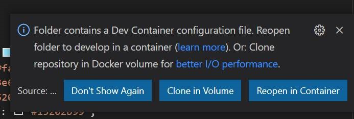
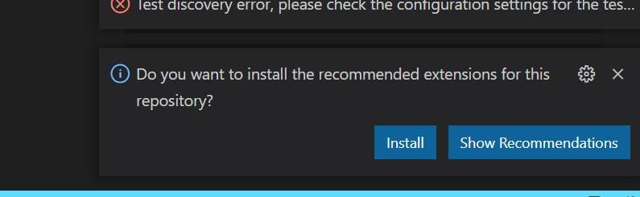
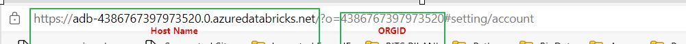
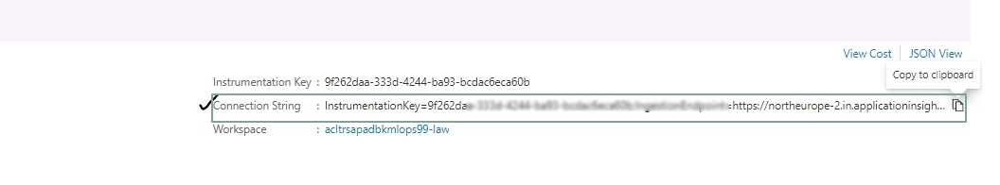
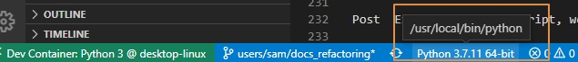
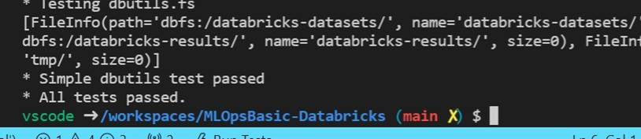
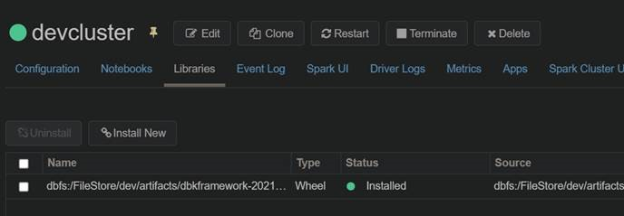
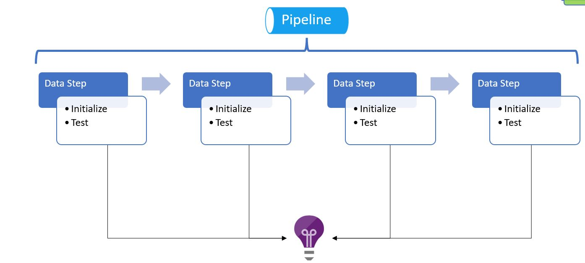
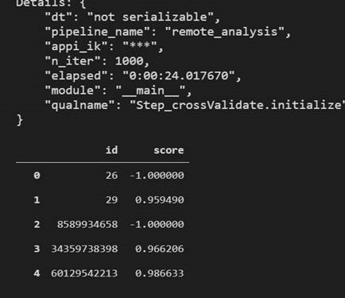

---
---
 <br>

 
 # Section 1: DevOps Agent Deployment of CI/CD Databricks Environments
---
 
 ## CI/CD Pathway Diagram
 
<p align="center">
  
</p>

---

## Section 1: DevOps Agent Deployment of CI/CD Databricks Environments
- [Youtube Demo](#Youtube-Demo)
- [About This Repository](#About-This-Repository)
- [Prerequisites](#Prerequisites)
- [Details of The Solution Accelerator](#Details-of-The-Solution-Accelerator)
- [Databricks as Infrastructure](#Databricks-as-Infrastructure)
- [Continuous Deployment and Branching Strategy](#Continuous-Deployment-And-Branching-Strategy)
- [Create Repository](#Create-Repository)
- [Login to Azure](#Login-To-Azure)
- [Provide SubscriptionID ](#Provide-SubscriptionID)
- [Create Main Service Principal](#Create-Main-Service-Principal)
- [Create Databricks Service Principal](#Create-Databricks-Service-Principal)
- [Final Snapshot of Github Secrets](#Final-Snapshot-of-Github-Secrets)
- [Retrieve Object ID's](#Retrieve-Object-IDs)
- [Update Yaml Pipeline Parameters Files](#Update-Yaml-Pipeline-Parameters-Files)
- [Deploy the Azure Environments](#Deploy-The-Azure-Environments)
- [Run Machine Learning Scripts](#Run-Machine-Learning-Scripts)


## Section 2: Databricks Connect Local Development (Docker)
- [Interact With Databricks From Local VS Code Using Databricks Connect + Docker Image](#Interact-With-Databricks-From-Local-VS-Code-Using-Databricks-Connect-And-Docker)
---
---

## Youtube Demo 

[](https://www.youtube.com/embed/Q3DNOgIu6rk)
---

## About This Repository

This Repository contains an Azure Databricks Continuous Deployment _and_ Continuous Development Framework for delivering Data Engineering/Machine Learning projects based on the below Azure Technologies:


| Azure Databricks | Azure Log Analytics | Azure Monitor Service  | Azure Key Vault        |
| ---------------- |:-------------------:| ----------------------:| ----------------------:|


Azure Databricks is a powerful technology, used by Data Engineers and Scientists ubiquitously. However, operationalizing it within a Continuous Integration and Deployment setup that is fully automated, may prove challenging. 

The net effect is a disproportionate amount of the Data Scientist/Engineers time contemplating DevOps matters. This Repository's guiding vision is to automate as much of the infrastructure as possible.

---
---

## Prerequisites
<details open>
<summary>Click Dropdown... </summary>
<br>
  
- Github Account
- Microsoft Azure Subscription
- VS Code
- Azure CLI Installed (This Accelerator is tested on version 2.39)
- Docker Desktop Installed (not required for Section 1)

</details>

---
---

## Details of The Solution Accelerator

- Creation of four environments:
  - Development 
  - User Acceptance Testing (UAT)
  - Pre-Production
  - Production
- Full CI/CD between environments
- Infrastructure-as-Code for interacting with Databricks API and also CLI
- Logging framework using the [Opensensus Azure Monitor Exporters](https://github.com/census-instrumentation/opencensus-python/tree/master/contrib/opencensus-ext-azure)
- Databricks Continuous Development from VS Code IDE using the [Databricks Connect](https://docs.microsoft.com/en-us/azure/databricks/dev-tools/databricks-connect#visual-studio-code) feature
- Azure Service Principal Authentication
- Azure resource deployment using BICEP
- Examples given within Development Framework using the Python SDK for Databricks
- Docker Environment in VS Code (Section 2)

---
---

## Databricks as Infrastructure
<details open>
<summary>Click Dropdown... </summary>

<br>
There are many ways that a User may create Databricks Jobs, Notebooks, Clusters, Secret Scopes etc. <br>
<br>
For example, they may interact with the Databricks API/CLI by using: <br>
<br>
i. VS Code on their local machine, <br>
ii. the Databricks GUI online; or <br>
iii. a YAML Pipeline deployment on a DevOps Agent (e.g. GitHub Actions or Azure DevOps etc). <br>
<br>
 
The programmatic way in which the first two scenarios allow us to interact with the Databricks API is akin to "Continuous **Development**", as opposed to "Continuous **Deployment**". The former is strong on flexibility, however, it is somewhat weak on governance, accountability and reproducibility. <br>

In a nutshell, Continuous **Development** _is a partly manual process where developers can deploy any changes to customers by simply clicking a button, while continuous **Deployment** emphasizes automating the entire process_.

</details>

---
---

 ## Continuous Deployment And Branching Strategy

The Branching Strategy I have chosen is configured automatically as part of the accelerator. It follows a GitHub Flow paradigm in order to facilitate rapid Continuous Integration, with some nuances. (see Footnote 1 which contains the SST Git Flow Article written by Willie Ahlers for the Data Science Toolkit - This provides a narrative explaining the numbers below)[^1]


-   Feature Branch merged to Main Branch: resource deployment to Development environment 
-   Merge Request from Main Branch to Release Branch: deploy to UAT environment
-   Merge Request Approval from Main Branch to Release Branch: deploy to Pre-Production environment
-   Tag Release Branch with Stable Version: deploy to Production environment


---
---

## Create Repository
<details open>
<summary>Click Dropdown... </summary>
<br>
  
- Fork this repository
- In your Forked Repo, click on 'Actions' and then 'Enable'
- Within your VS Code , "View" --> "Command Pallette" --> "Git: Clone" --> Select <yourUserName>/DatabricksAutomation
</details>

---
---
 
## Login To Azure
- All Code Throughout To Go Into VS Code **PowerShell Terminal** 

 ```ps
az login

```


## Provide SubscriptionID 
```ps
$SubscriptionId=( az account show --query id -o tsv )
```

## Create Main Service Principal 
**Why**: You will need to assign RBAC permissions to Azure Resources created on the fly.

```ps
echo "Create The Service Principal"

echo "WARNING: DO NOT DELETE OUTPUT "

$Main_SP_Name= "Main_SP_"+$(Get-Random -Minimum 1000 -Maximum 9999)
az ad sp create-for-rbac -n $Main_SP_Name --role Owner --scopes /subscriptions/$SubscriptionId --sdk-auth
 
```

Ensure that the Service Principal names are unique within your Tenant. If not unique, you may see the error "Insufficient privileges to complete the operation"

## Secrets
Create GitHub Secret titled **AZURE_CREDENTIALS** using the output generated from the previous command.


---
---

## Create Databricks Service Principal 

**Why**: For those who only need permissions to create resources and interact with the Databricks API (zero trust).


```ps
echo "Create The Service Principal"
 
echo "WARNING: DO NOT DELETE OUTPUT"

$Databricks_SP_Name= "DatabricksSP_"+$(Get-Random -Minimum 1000 -Maximum 9999) 
$DBX_CREDENTIALS=( az ad sp create-for-rbac -n $Databricks_SP_Name --role Contributor --scopes /subscriptions/$SubscriptionId --query "{ARM_TENANT_ID:tenant, ARM_CLIENT_ID:appId, ARM_CLIENT_SECRET:password}")

echo "Service Principal Credentials"
$DBX_CREDENTIALS=( $DBX_CREDENTIALS | convertfrom-json )
echo $DBX_CREDENTIALS
 
$DBX_SP_Client_ID=( $DBX_CREDENTIALS.ARM_CLIENT_ID )
 
```

## Secrets
Create GitHub Secrets entitled **ARM_CLIENT_ID**, **ARM_CLIENT_SECRET** and **ARM_TENANT_ID** using the output in VS Code PowerShell Terminal. See below.


---
---

 
## Final Snapshot of GitHub Secrets

Secrets in GitHub should look exactly like below. The secrets are case sensitive, therefore be very cautious when creating. 


---
---
 
## Retrieve Object IDs 

**Why**: The Object IDs will be used when assigning RBAC permissions at a later stage. 

1. Retrieve ObjectID of Databricks Service Principal:  
```ps
$DBX_SP_ObjID=( az ad sp show --id $DBX_SP_Client_ID --query "{roleBeneficiaryObjID:id}" -o tsv )

echo "Back Stop Command For Older Azure CLI Command"
 
if ($DBX_SP_ObjID -eq "None" ) { $DBX_SP_ObjID=( az ad sp show --id $DBX_SP_Client_ID --query "{roleBeneficiaryObjID:objectId}" -o tsv ) }
 
```

---

2. Retrieve your own ObectID:  
```ps
 
$AZ_ACCOUNT_ALIAS=( az account show --query user.name -o tsv )
$User_ObjID=( az ad user show --id $AZ_ACCOUNT_ALIAS --query "{roleBeneficiaryObjID:id}" -o tsv )
 
echo "Back Stop Command For Older Azure CLI Command"
 
if ($User_ObjID -eq "None" ) { $User_ObjID=( az ad sp show --id $AZ_ACCOUNT_ALIAS --query "{roleBeneficiaryObjID:objectId}" -o tsv ) }
 
```
---
---
 
## Update Yaml Pipeline Parameters Files

- The Parameters file can be thought of as a quasi ARM Template for Databricks
- Parameters files can be found at: /.github/workflows/Pipeline_Param/<environment-file-name> [a relative link](.github/workflows/Pipeline_Param/)


We will update the parameters files ( Development.json, UAT.json, PreProduction.json, Production.json). Enter script below into VS Code PowerShell Terminal to update files automatically.
  
```ps
echo "Enter Your Git Username... "
  
$Git_Configuration = "Ciaran28"
```
  
  ```ps
echo "Enter Your Git Repo Url... "
  
$Repo_ConfigurationURL = "https://github.com/ciaran28/DatabricksAutomation"
```
  
  
```ps
echo "Update The Parameter Files"
$files = @('Development.json','UAT.json', 'PreProduction.json', 'Production.json' )

Foreach($file in $files)
{
    $JsonData = Get-Content .github\workflows\Pipeline_Param\$file -raw | ConvertFrom-Json

    $JsonData.RBAC_Assignments | % {if($_.Description -eq 'You Object ID'){$_.roleBeneficiaryObjID=$User_ObjID}}

    $JsonData.RBAC_Assignments | % {if($_.Description -eq 'Databricks SPN'){$_.roleBeneficiaryObjID=$DBX_SP_ObjID}}

    $JsonData.update | % {$JsonData.SubscriptionId = $SubscriptionId}

    foreach ($Obj in $JsonData.Git_Configuration)
    {
        ($Obj.git_username = $Git_Configuration )
    }

    foreach ($Obj in $JsonData.Repo_Configuration)
    {
        ($Obj.url = $Repo_ConfigurationURL )
    }

    $JsonData | ConvertTo-Json -Depth 4  | set-content .github\workflows\Pipeline_Param\$file -NoNewline

}
```


## Update GitHub Repo - Git Push

- There is a tendency for EOF to default to Windows CRLF (\r\n) in VS Code. Our deployment will use an Ubuntu Image for the GitHub Action Runner, which will not recognise carriage return \r\n.
- The command below will convert \r\n to \n , which is the equivalent to changing all files in VS Code from CRLF to LF. It will then promote our local changes to the remote repository. 
- Run the command below from root folder

```ps
git add . 
git commit . -m 'Demo Deployment Commit'

git config core.autocrlf false
git rm --cached -r .
git reset --hard
git push

```


---
---
 
## Deploy The Azure Environments 

- In GitHub you can manually run the pipeline to deploy the environments to Azure using:
  - .github\workflows\1-DBX-Manual-Full-Env-Deploy.yml


 
- Azure Resources created (Production Environment snapshot)
  


- Snapshot of completed GitHub Action deployment 


---
---

## Run Machine Learning Scripts
- Find the script at src/tutorial/scripts/framework_testing/remote_analysis


---
---

## Continuous Integration and Deployment
- Demo to follow 
- Best Practice: Connect the Repo in your **own user folder** in Databricks REPO.
- Admin will see two User Folders. The first is their own e.g. ciaranh@microsoft.com... and the other is the **Service Principal User Folder**, named after it's ClientID.
- The cluster will run off the Service Principal Scripts (isolated and can only be updated when a Feature Branch is merged into Main)

The process for CI/CD in Databricks is thus:
1. Work in your User Folder 


2. Create a Feature Branch from Main. 
3. Develop code in **your Feature Branch** 
4. Push code regularly from Feature Branch
5. When feature is complete, create a Pull Request from **Feature Branch to Main**
6. If the Pull Request is approved, the files within the **Service Principal folder** will update. The Clusters in the Dev environment will now run off the updated code. 


7. If the Development Databricks Instance is stable and ready to be promoted to the Test Environment, create a Pull Request from **Main to Release**
8. Changes will cascade into the UAT Databricks Instance
9. If tests are successful, the Pull Request is **approved**, which will trigger a release pipeline to propagate changes to the PreProduction Environment
10. The above will happen iteratively, until the PreProduction environment is stable enough for a new release version, at which we Tag the Release Branch with a version number, e.g "v-1.0.1". This will promote changes to the Production Environment. **Release Pipeline for Production Environment not yet complete** 
   
# Section 2
---
---
 
## Interact With Databricks From Local VS Code Using Databricks Connect And Docker

In the previous section, we interacted with Databricks API from the DevOps Agent.

But what if we wish to interact with the Databricks environment from our local VS Code? In order to do this we can use "Databricks Connect".

Now... enter Docker. Why are we using this? Configuring the environment set up for Databricks Connect on a Windows machine is a tortuous process, designed to break the will of even the most talented programmer. Instead, we will use a Docker Image which builds a containerized Linux environment within the VS Code Workspace, dealing with all of the environment variables and path dependencies out of the box. 

## Steps


1. Clone the Repository : https://github.com/microsoft/dstoolkit-ml-ops-for-databricks/pulls
2. Install Docker Desktop. Visual Code uses the docker image as a remote container to run the solution.
3. Create .env file in the root folder, and keep the file blank for now. (root folder is the parent folder of the project)
4. In the repo, open the workspace. File: workspace.ode-workspace.

> Once you click the file, you will get the "Open Workspace" button at right bottom corner in the code editor. Click it to open the solution into the vscode workspace.


5. We need to connect to the [docker image as remote container in vs code](https://code.visualstudio.com/docs/remote/attach-container#_attach-to-a-docker-container). In the code repository, we have ./.devcontainer folder that has required docker image file and docker configuration file. Once we load the repo in the vscode, we generally get the prompt. Select "Reopen in Container". Otherwise we can go to the VS code command palette ( ctrl+shift+P in windows), and select the option "Remote-Containers: Rebuild and Reopen in Containers"



6. In the background, it is going to build a docker image. We need to wait for sometime to complete build. the docker image will basically contain the a linux environment which has python 3.7 installed. Please have a look at the configuration file(.devcontainer\devcontainer.json) for more details. 
7. Once it is loaded. we will be able to see the python interpreter is loaded successfully. Incase it does not show, we need to load the interpreter manually. To do that, click on the select python interpreter => Entire workspace => /usr/local/bin/python


8. You will be prompted with installing the required extension on the right bottom corner. Install the extensions by clicking on the prompts.



9. Once the steps are completed, you should be able to see the python extensions as below:


Note: Should you change the .env file, you will need to rebuild the container for those changes to propogate through. 


## Create the .env file


We need to manually change the databricks host and appI_IK values. Other values should be "as is" from the output of the previous script.

- PYTHONPATH: /workspaces/dstoolkit-ml-ops-for-databricks/src/modules [This is  full path to the module folder in the repository.]
- APPI_IK: connection string of the application insight
- DATABRICKS_HOST: The URL of the databricks workspace.
- DATABRICKS_TOKEN: Databricks Personal Access Token which was generated in the previous step.
- DATABRICKS_ORDGID: OrgID of the databricks that can be fetched from the databricks URL.



Application Insight Connection String



At the end, our .env file is going to look as below. You can copy the content and change the values according to your environment.

``` conf
PYTHONPATH=/workspaces/dstoolkit-ml-ops-for-databricks/src/modules
APPI_IK=InstrumentationKey=e6221ea6xxxxxxf-8a0985a1502f;IngestionEndpoint=https://northeurope-2.in.applicationinsights.azure.com/
DATABRICKS_HOST=https://adb-7936878321001673.13.azuredatabricks.net
DATABRICKS_TOKEN= <Provide the secret>
DATABRICKS_ORDGID=7936878321001673
```

## Section 5: Configure the Databricks connect


1. In this step we are going to configure the databricks connect for VS code to connect to databricks. Run the below command for that from the docker (VS Code) terminal.

``` bash
$ python "src/tutorial/scripts/local_config.py" -c "src/tutorial/cluster_config.json"
```

>Note: If you get any error saying that "ModelNotFound : No module names dbkcore". Try to reload the VS code window and see if you are getting prompt  right bottom corner saying that configuration file changes, rebuild the docker image. Rebuild it and then reload the window. Post that you would not be getting any error. Also, check if the python interpreter is being selected properly. They python interpreter path should be **/usr/local/bin/python **



### Verify

1. You will be able to see the message All tests passed.



## Section 6: Wheel creation and workspace upload


In this section, we will create the private python package and upload it to the databricks environment.

1. Run the below command:

``` bash
python src/tutorial/scripts/install_dbkframework.py -c "src/tutorial/cluster_config.json"
```

Post Execution of the script, we will be able to see the module to be installed.



## Section 7: Using the framework


We have a  pipeline that performs the data preparation, unit testing, logging, training of the model.





### Execution from Local VS Code

To check if the framework is working fine or not, let's execute this file : **src/tutorial/scripts/framework_testing/remote_analysis.py** . It is better to execute is using the interactive window. As the Interactive window can show the pandas dataframe which is the output of the script. Otherwise the script can be executed from the Terminal as well.
To run the script from the interactive window, select the whole script => right click => run the selection in the interactive window.

Post running the script, we will be able to see the data in the terminal.



---
# Apendix
 
[^1]: https://microsofteur.sharepoint.com/teams/MCSMLAISolutionAccelerators/SitePages/Contribution-Guide--How-can-I-contribute-my-work-.aspx?xsdata=MDV8MDF8fDdiODIxYzQxNjQ5NDRlMDQzNWZkMDhkYTc1NmIwMjJlfDcyZjk4OGJmODZmMTQxYWY5MWFiMmQ3Y2QwMTFkYjQ3fDB8MHw2Mzc5NTEzOTk2ODQ4Nzk4Njl8R29vZHxWR1ZoYlhOVFpXTjFjbWwwZVZObGNuWnBZMlY4ZXlKV0lqb2lNQzR3TGpBd01EQWlMQ0pRSWpvaVYybHVNeklpTENKQlRpSTZJazkwYUdWeUlpd2lWMVFpT2pFeGZRPT18MXxNVGs2YldWbGRHbHVaMTlPZWxWNlQwUkpNbGw2VVhST01rVjVXbE13TUZscWFHeE1WMGw0VGxSbmRGcFVWbTFOUkUxNFRtMUpOVTFVVVhsQWRHaHlaV0ZrTG5ZeXx8&sdata=QVcvTGVXVWlUelZ3R2p6MS9BTTVHT0JTWWFDYXBFZW9MMDRuZ0RWYTUxRT0%3D&ovuser=72f988bf-86f1-41af-91ab-2d7cd011db47%2Cciaranh%40microsoft.com&OR=Teams-HL&CT=1660511292416&clickparams=eyJBcHBOYW1lIjoiVGVhbXMtRGVza3RvcCIsIkFwcFZlcnNpb24iOiIyNy8yMjA3MzEwMTAwNSIsIkhhc0ZlZGVyYXRlZFVzZXIiOmZhbHNlfQ%3D%3D#sst-flow
